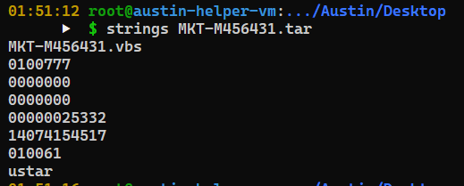
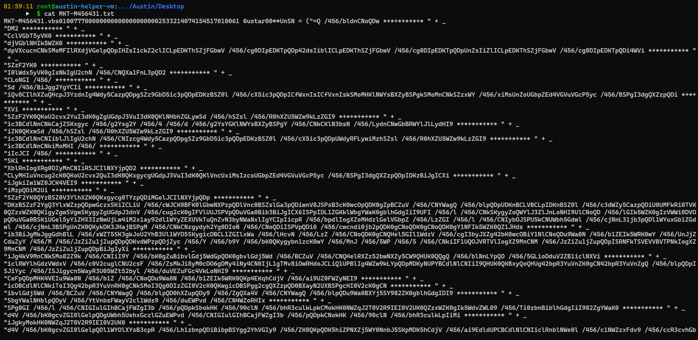
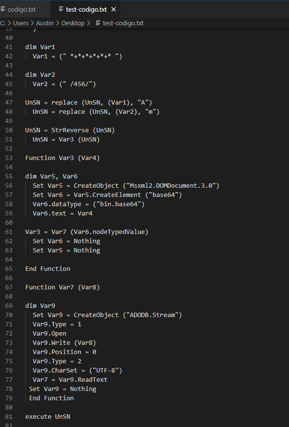
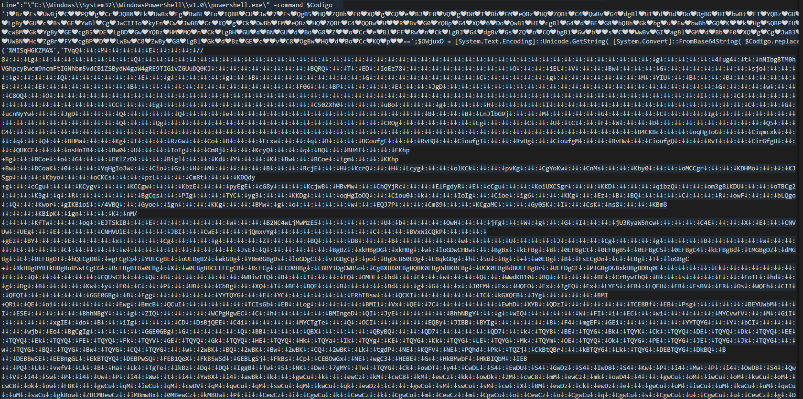

# Spear Phishing Email Malicious Attachment WriteUp

> Austin Lai | July 29th, 2021

---

<!-- Description -->

WriteUp Regarding a Spam Email - Spear Phishing - Malicious Attachment

WriteUp with sanitized and generic information.

<!-- Description -->

<br />

## Table of Contents

<!-- TOC -->

- [Spear Phishing Email Malicious Attachment WriteUp](#spear-phishing-email-malicious-attachment-writeup)
    - [Table of Contents](#table-of-contents)
    - [Analysis](#analysis)
        - [Malicious activities reported by Endpoint Detection and Response EDR Solution](#malicious-activities-reported-by-endpoint-detection-and-response-edr-solution)
        - [Investigate through SIEM](#investigate-through-siem)
            - [Additional Note](#additional-note)
        - [Malicious Activities Triggered Details](#malicious-activities-triggered-details)

<!-- /TOC -->

<br />

## Analysis

### Malicious activities reported by Endpoint Detection and Response (EDR) Solution

- Events from EDR shown malicious powershell code execution
- Suspicious vbs scripts generated
- Logs captured powershell payload command

<br />

### Investigate through SIEM

- Information gathered from \[ logs \| events \] as below:

    - First email seen
    - There was no relevant log shown in anti-spam
    - It was not reflected as spam.
    - Logs show the phishing email was forwarder to multiple recipients via group email
    - No relevant windows log can be found (relevant windows logs not collected)
    - No relevant endpoint security log can be found
    - It was not reflected as virus nor malware
    - No firewall log shown relevant event
    - No Web Isolation logs shown relevant event

<br />

#### Additional Note

If you have the access to the Windows Event Log of Infected Machines, you will find alot more details regards to the malicious activity, provided you have turn on Windows Audit and Logging in the first place.

Try to look at the "Windows Powershell" log as well.

<br />

### Malicious Activities Triggered Details

- Victim accidentally open the spam phishing email and clicked the attachment

- Checking and analysing the attachment name “MKT-M45631.tar”

    - It shown as POSIX tar archive file

        

- However, it contains a vbs name “MKT-M456431.vbs”

    

- Checking the head of the tar file, we can see the content of “MKT- M456431.vbs”

    

- By changing the malicious tar file extension from “tar” to “txt”

    

- Checking the content inside

    

    

    - The malicious vbs execute a command that store in variable name “BMJj” connect and download a stager ``` https://ia801802.us.archive.org/0/items/codigo_202104/codigo[.]txt ```

    - The “codigo.txt” turn out is a JScript file and it create the object as vbs to execute the code by wscript.exe as show in the above.

- The variable name “UnSN” is an obfuscated command later on pass to the “codigo.txt” as shown below

    

    - The variable name “UnSN” passed and used inside “codigo.txt”

    - It first de-obfuscated, then and reverse the string

- This is the strings after de-obfuscated and reversed and stored in “UnSN” variable

    

- Later on pass to function named “var3” to create XML Object with base64 encoded as binary

- The pass to function named “var7” to stream the encoded binary

- The initial vbs generate subsequent vbs until to get the full payload which will execute a PowerShell command that captured in Windows Event Log – PowerShell and falcon as shown below

    

- And the initial vbs named “MKT-M45631.vbs” remain on victim machines in order to re-generate subsequent vbs script that lead to EDR report multiple incident on following days

    

    

    - While we looked and dissect the PowerShell command

    - It is an obfuscated and base64 encoded string

- The first part was to replace the “love” symbol to character “A” and you will get base64 encoded strings as below

    

- The second part to decode it with base64 you will get below command

    

- There is a variable named “%MISqHGKZMA%” in the same PowerShell Command which is also an obfuscated strings.

- Based on the decode base64 strings, we now get the command to de-obfuscated variable named “%MISqHGKZMA%”

- As shown below, the variable named “%MISqHGKZMA%” was first pass to a function to replace symbol “↓:↓” to character “A” and then pass to function to decoded it with base64 and then it stored as a byte array variable named “$xIOU”

    

- Lastly, it use the vbs function to stream and load the binary as below

    

- Due to EDR terminate and blocked the process, there is no binary generated and there might missing some byte to re-create the malicious binary

<br />

---

> Do let me know any command or step can be improve or you have any question you can contact me via THM message or write down comment below or via FB
